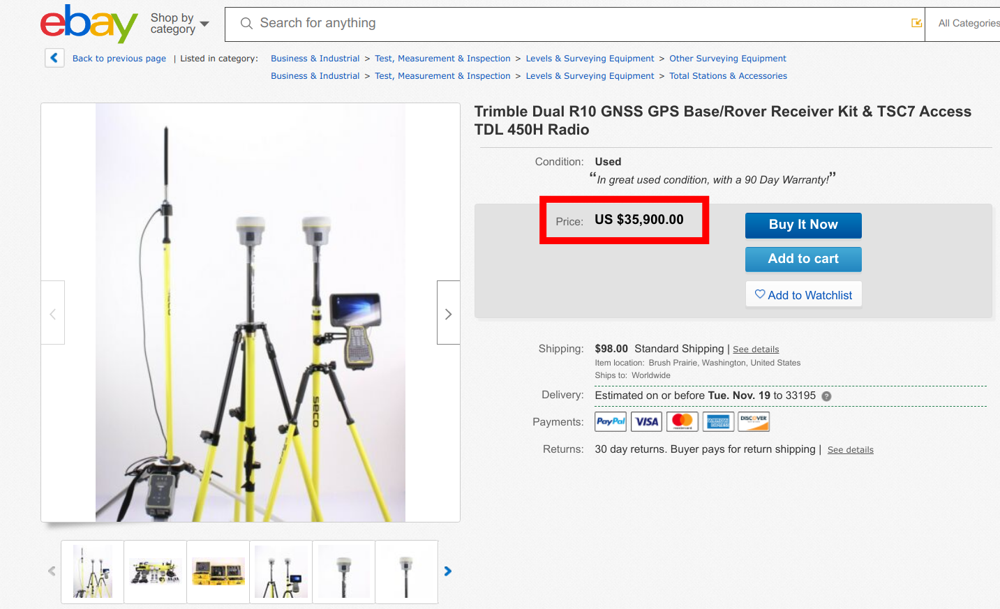
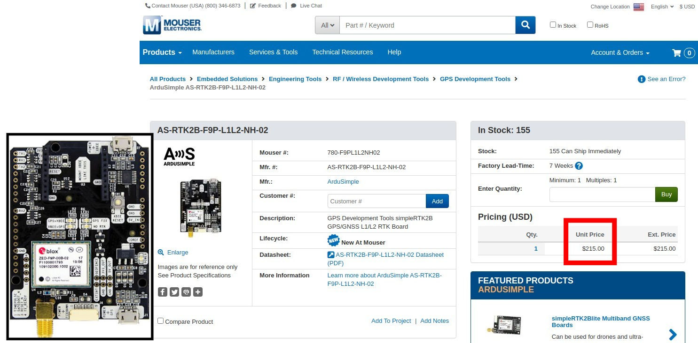
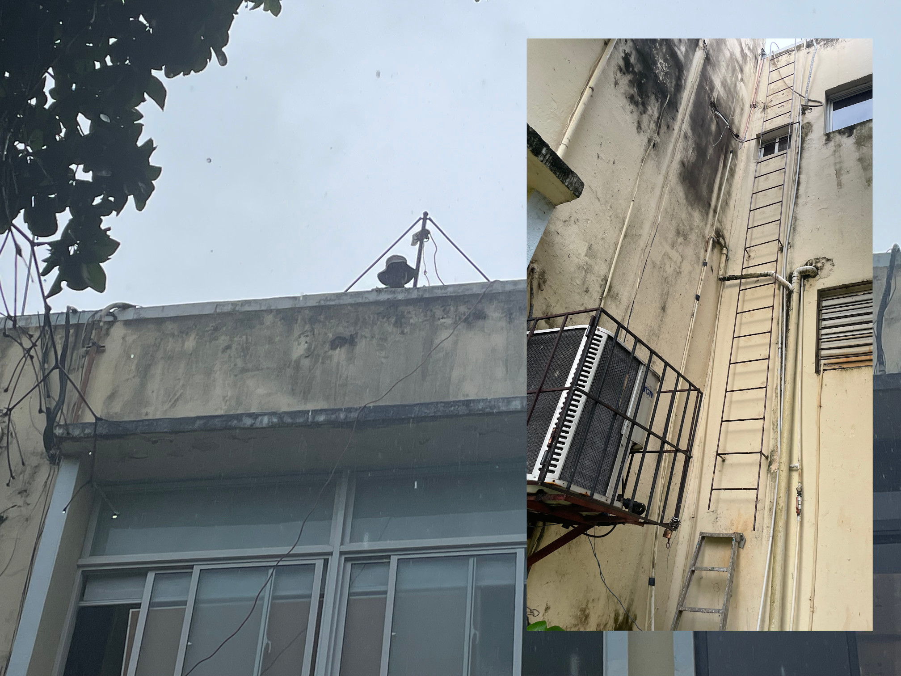

```{r setup, include=FALSE, echo=F}
knitr::opts_chunk$set(echo = FALSE)
ruta_figuras <- 'img/'
```

# Objetivos

- Realizar un modelo digital del terreno del campus de la UASD (Sede) usando tecnología GNSS.

- Evaluar la metodología de colecta y procesamiento en modo cinemático para generar soluciones fijas de bajo error que produzcan una nube de puntos interpolables para generar el MDT.

- Evaluar el rendimiento de distintas antenas de parche y de plato.

# JUSTIFICACIÓN

##

- La __elevación precisa y de alta resolución, es difícil de obtener__, pero extremadamente necesario para infinidad de aplicaciones.

- El equipamiento funcional _out of the box_ para obtenerlo es __extremadamente costoso__.

- Enseñar y aprender (ambas cosas) tecnología GNSS __era un lujo__ reservado para unas pocas personas.

##

- Red __pública__ de CORS (estaciones de referencia de operación continua) de __muy poca densidad__.

- __Existen redes privadas y densas__, pero de __costos__ elevados.

- Predominio de __soluciones__ de software y hardware __cerradas__.

## Las opciones.

Si nuestro criterio de elección es la funcionalidad _out of the box_, las alternativas legales se parecen a estas (precios en USD) ...

{width=80%}

## 

## 

## 

## ... o armamos nuestros propios receptores usando placas y módulos OEM ...



## 

## 

## ... y los operamos con software de código abierto y servicios gratuitos.

{width=55%}
https://github.com/Stefal/rtkbase

## {width=75%}
http://rtk2go.com/

## Aplicaciones

* __APRENDER Y ENSEÑAR SIN MIEDO A TENER QUE EMPEÑAR UN RIÑÓN__.

## {width=50%}
Fotos: Cinthia Vandepool y Edwin Fernández

## {width=60%}

## Aplicaciones

* Topografía y mensura.

* Monitoreo de __la deformación del terreno (e.g. subsidencia), deslizamientos, fallas__.

* Perfil de __playa__, sección transversal del __río__, apoyo a la hidráulica fluvial.

* __Inventario preciso de seres vivos__, especialmente de plantas.

* Corrección en el procesamiento __fotogramétrico y de datos LiDAR__.

## Aplicaciones

* Construcción, monitoreo de __edificaciones y estructuras__ (puentes).

* __Agricultura__ de precisión.

* Detección de __tsunamis__ por boyas GNSS.

* Sistemas de __transporte__, vehículos autónomos.

* Sistemas de cartografía __móviles__ (Street View).

* El "etc." es bastante extenso.

# MATERIALES Y MÉTODOS

```{bash, eval=F, include=F, echo=F}
convert -density 300 -background white -alpha remove -alpha off -resize 1920x \
  presentaciones/img/metodologia-grafica.pdf \
  presentaciones/img/metodologia-grafica.jpg
```

## 

## {width=85%}

## 

## 

## {width=45%}

## 
http://rtk2go.com:2101/SNIP::MOUNTPT?NAME=geofis_mbase

## {width=75%}
__"'Ta rota, pero eso no e' na'"__

<small>Foto: Saderis Carmona</small>

# RESULTADOS

## 
<small>Posición de la base según CSRS-PPP de NRCan. Los datos enviados con una tasa de muestreo de 30 segundos, pero la base colectó una época cada segundo para proveer correcciones RTCM y permitir soluciones RTK (éstas últimas no usadas, sólo para comprobar funcionalidad del motor interno de los módulos en terreno)</small>

## 
<small>En rovers, una época cada 0.2 segundos, frecuencia de muestreo de 5 Hz</small>

## 

## Soluciones fijas

- Un cuarto de millón de soluciones FIX, de las que, usando un criterio extremadamente conservador, basado en el umbral 5 para la razón entre los residuos al cuadrado de la segunda mejor solución y la mejor solución.

- Para la interpolación, se utilizaron ca. 90,000 soluciones fijas, pero se podían haber usado muchas más usando un criterio menos estricto.

- La interpolación se realizó con splines multinivel utilizando funciones base (B-splines).

## 

## 

## 

# DISCUSIÓN

- Se alcanzaron los objetivos propuestos inicialmente, y un poco más. 

- Se evaluó el error usando soluciones de ocupaciones estáticas anteriores realizadas en el BM ALMA y en el localizado frente a la rotonda de la FIA, y las diferencias fueron apenas centimétricas.

- La metodología empleada es idónea para la producción de cartografía topográfica precisa.

- Las antenas de plato mostraron un rendimiento ligeramente mejor que las de parche.

## Desafíos futuros

- Clasificar nube de puntos.

- Añadir cámara para fotogrametría terrestre.

- Añadir más recorridos en las áreas próximas a edificaciones, controlando el efecto multitrayecto.

- Visitar áreas que, por encontrarse en uso (e.g. play de softball), no pudieron cubrirse.

## Desafíos futuros

- Desarrollar el mismo flujo de trabajo con compensación por inclinación y acelaración, así como con receptores de doble antena.

- Realizar más ocupaciones estáticas de larga duración en distintos puntos del campus.

- Instalar más bases en el campus. Son bienvenidas las colaboraciones, pero sospecho que sólo serán fructíferas aquellas en las que el/la interesado/a se apropia de su propio proceso de confección y, especialmente, del mantenimiento.

#

<section style="font-size: 72px; text-align: center;">

<br>

 jmartinez19\@uasd.edu.do

 geofis

</section>
